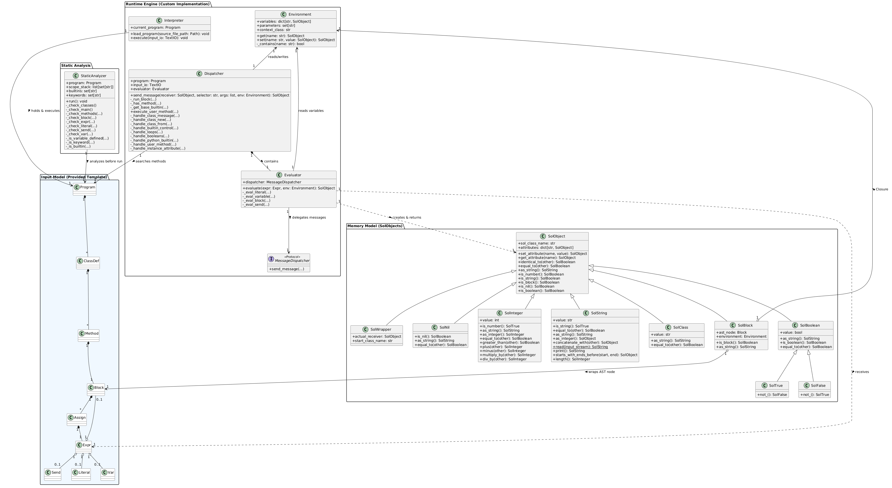

# IPP project - Interpreter of SOL26

**Author:** Andrej Bližnák (xblizna00)  
**Date:** April 2026/04/21

---

## Overall Design Description

The interpreter builds upon the provided project template. The entry point `solint.py` handles CLI arguments, validates input paths, and delegates execution to the `Interpreter` class. In `interpreter.py`, the source SOL-XML is parsed with `lxml`, validated through the provided data model (`input_model.py`), and converted into a typed AST (`Program`).

Before runtime execution starts, the AST is checked by `static_analyzer.py`. This phase verifies semantic constraints without evaluating the program: class definition consistency (including inheritance checks), required `Main - run` presence and arity, selector/block arity consistency, variable-definition rules in nested scopes, and reserved-name collisions. If any static semantic rule is violated, interpretation terminates with the corresponding semantic error code.

If the program passes static checks, runtime is handled by `dispatcher.py` and `evaluator.py`. `Evaluator` evaluates expression nodes (literals, variables, blocks, sends) and delegates message sends to `Dispatcher`. `Dispatcher` is the central message-routing component: it resolves class messages (`new`, `from:`, `read` for strings), control-flow built-ins (`value`, `whileTrue:`, `timesRepeat:`, `ifTrue:ifFalse:`, `and:`, `or:`), Python-level built-ins mapped from selectors, user-defined methods in inheritance order, and finally instance-attribute getters/setters.

Memory and runtime values are represented by `environment.py` and `sol_objects.py`. `Environment` stores variables with parent chaining, which enables lexical scoping for closures. `SolBlock` captures both block AST and its defining environment, and `SolWrapper` is used to implement `super` dispatch context. Runtime entities are modeled as subclasses of `SolObject` (`SolInteger`, `SolString`, `SolBoolean`, `SolBlock`, `SolClass`, `SolNil`), including singleton instances for `nil`, `true`, and `false`, while type-specific behavior is encapsulated in these classes.

## Main Internal Data Structures

* **`Environment`**: This structure manages lexical scope by storing variables in `variables` and linking scopes through an optional parent reference (`self.parent`). Block and method arguments are bound into the current environment as regular variables during block execution, and lookups recurse through parent environments to preserve closure behavior.

* **`SolObject`**: The universal base class representing runtime entities in the SOL26 memory model. It provides shared object state through the `attributes` dictionary and keeps runtime class identity in `sol_class_name`, while concrete subclasses override behavior for specific value types.

## Usage of Design Patterns and OOP Principles

* **Singleton:** The Singleton pattern is used for core language constants `Nil`, `True`, and `False` (`SOL_NIL`, `SOL_TRUE`, `SOL_FALSE` in `sol_objects.py`). These shared instances provide stable canonical values across runtime, and the dispatcher leverages identity checks (`is`) for boolean control-flow decisions.

* **Proxy / Wrapper:** To implement the correct behavior of the `super` keyword without altering the state of the original object or causing infinite dispatch loops, a Proxy pattern is utilized via the `SolWrapper` class. When `super` is referenced, the interpreter creates a lightweight `SolWrapper` that holds the `actual_receiver` and the `start_class_name`. This allows the `Dispatcher` to securely route the message to the correct parent class while preserving the original `self` context.

* **Factory Method:** Centralized object creation is implemented in the `Dispatcher` via the `_handle_class_new` and `_handle_class_from` methods. Based on the requested class name and its base built-in type, these factory methods instantiate the correct underlying Python objects (e.g., `SolInteger` or `SolBlock`), isolating the instantiation logic from the rest of the evaluator.

* **Polymorphism:** SOL26 runtime values are modeled as `SolObject` descendants with shared operations (`as_string`, `equal_to`, `is_number`, etc.) overridden in concrete types such as `SolInteger`, `SolString`, and `SolBoolean`. This keeps most type-specific behavior encapsulated in object classes; the dispatcher still performs explicit type checks in selected control-flow and runtime-validation paths.

## Implementation Challenges and Design Decisions

* **Separation of Behavior and Control Flow:** A key design challenge was defining the boundary between object-level behavior and central runtime control. Type-specific operations (arithmetic, string conversion/manipulation, equality, predicates) are implemented directly in `SolObject` subclasses, while message-routing concerns remain in `Dispatcher` (class-side construction via `new`/`from:`, block execution through `value`, and control flow such as `whileTrue:` or `ifTrue:ifFalse:`). This keeps `Evaluator` focused on AST-to-object evaluation and delegates runtime orchestration to one place.

* **Resolving `super` Delegation:** Implementing `super` required preserving the original receiver while changing only the method-lookup starting point. Instead of copying environments or mutating objects, the runtime creates a lightweight `SolWrapper` that stores `actual_receiver` and `start_class_name` (the parent of the currently executing class). The dispatcher unwraps this proxy and starts lookup from that parent branch, preserving `self` semantics and preventing recursive redispatch through the same class.

## AI Usage and Workflow Transparency

During the development of this project, artificial intelligence tools were utilized transparently as consultative, analytical, and refactoring aids. The workflow relied on different models depending on their specific strengths:

* **Gemini 3 Pro:** Served as the primary consultant for analyzing the project assignment. Due to its extensive context window, it was able to retain and cross-reference the entire specification at once. It was mainly used to verify whether architectural ideas aligned with the assignment requirements.
* **Claude Sonnet 4.6:** Utilized alongside Gemini for brainstorming complex implementation details, architectural design patterns, and debugging intricate logic.
* **GPT-5.3-codex Xhigh:** Employed primarily for rapid code refactoring and structural improvements. Its high inference speed made it ideal for optimizing existing, functioning code blocks without altering their logic.
* **Claude Haiku:** Assisted strictly with text formatting, stylistics, and grammar checking during the writing of this documentation.

### Typical Workflow and Prompts
The typical interaction involved submitting a specific concept, error, or a piece of my own code for analysis. Code was never blindly generated; AI was used as an interactive tutor. Examples of typical prompts included:
* *"Explain how [concept/mechanism] works under the hood."*
* *"[Code snippet] doesn't work. Could you help me identify why it fails?"*
* *"Could I implement [feature/pattern] using this specific approach?"*
* *"Does this [architectural decision] meet the assignment requirements?"*
* *"How could I improve or refactor this code to make it cleaner?"*

## Template changes

During the implementation of the testing tool, two functions (`parseArguments` in `tester.ts` and `executeSingleTest` in `executor.ts`) exceeded the maximum allowed cyclomatic complexity defined by ESLint (limit: 15). The reported complexity values were 20 and 23 respectively.

This situation arose as a direct consequence of extending the original project template with additional functionality required by the assignment specification, including:

- advanced CLI argument parsing with multiple filter combinations,
- normalization and validation of input parameters,
- execution pipeline logic combining multiple phases (discovery, filtering, execution, reporting),
- additional branching logic for optional features such as `--dry-run`, regex filtering, and verbose modes.

These features were intentionally implemented in a consolidated manner to preserve readability of the overall execution flow and to keep related logic within a single control structure rather than distributing it across multiple helper functions.

In the original project template, similar patterns of consolidated logic were already present, and the structure of the implementation is consistent with that design approach.

To satisfy ESLint constraints without introducing late-stage architectural refactoring, the complexity warning was explicitly suppressed using `eslint-disable-next-line complexity` directives.

This suppression affects only static analysis and does not impact runtime behavior, correctness, or test compatibility of the implementation.

## Dockerfile update

* **Removal of Network Dependencies (Offline-ready Approach):** In the original solution, the Node.js environment was installed dynamically using the `curl | bash` command, which led to fatal errors and build failures in the isolated, internet-free test environment. In the new solution, this technique is replaced by securely copying pre-built binary files directly from the official Docker images (`COPY --from=node:24-bookworm /usr/local /usr/local`). This approach is significantly faster, and guarantees the exact version of the interpreter.

* **Minimization of the Runtime Image:** The original `runtime` image contained development tools and compilers (such as `gcc`, `build-essential`, `libxml2-dev`), which unnecessarily bloated the container size and violated the principles of a minimal production image. The new `Dockerfile` strictly installs only the essential runtime libraries (`libxml2`, `libxslt1.1`) during the runtime phase.

* **Optimization of Dependency Management:** The modern and fast `uv` tool (`ghcr.io/astral-sh/uv`) was implemented for the installation of linters and static analysis in the Python environment.

* **Consistency of TypeScript Dependencies:** Instead of manual, hardcoded installation of global packages via the command line, the linters and TypeScript tools (ESLint, Prettier, etc.) are now installed correctly based on the definitions in the `package.json` file. This ensures better maintainability and reproducibility of the environment.

## References / Sources Used

The following academic and technical sources were used during the implementation of this project. They were primarily consulted for understanding programming language concepts, design patterns, TypeScript, and Docker.

* **Academic Literature:**
    SEBESTA, Robert W. *Concepts of Programming Languages*. Pearson Education, 10th–12th ed.  
  Available online:  
  https://www.kiv.zcu.cz/~jezek_ka/vyuka/PGS/Pro%20studenty/PGSSebesta10/concepts-of-programming-languages-10th-sebesta/concepts-of-programming-languages-10th-sebesta.pdf  

* **TypeScript Documentation:**
    TypeScript Handbook – From Scratch  
  https://www.typescriptlang.org/docs/handbook/typescript-from-scratch.html  

* **Design Patterns:**
    Design Patterns in Software Engineering (study materials, CTU FJFI)  
  https://people.fjfi.cvut.cz/viriumir/prednes/prezen/Navrhove_vzory.pdf  

* **Docker:**

    Docker Documentation – Writing a Dockerfile  
  https://docs.docker.com/get-started/docker-concepts/building-images/writing-a-dockerfile/  
    
    GeeksForGeeks – What is a Dockerfile  
  https://www.geeksforgeeks.org/cloud-computing/what-is-dockerfile/

## Potential Extensions

The modular architecture of the interpreter allows for the addition of several language extensions with minimal modifications:

* **Support for Interfaces (Extension 2):** Since static validation is centralized in the `StaticAnalyzer`, interface support would be implemented primarily as a static check. Interfaces would contain selector signatures only (no method bodies). Class declarations would keep the mandatory superclass and then carry a semicolon-separated list of implemented interfaces. The `Program` and `ClassDef` models in `input_model.py` would be extended with interface declarations, implemented-interface lists, and interface inheritance (including multiple interface inheritance). The analyzer would verify transitive selector obligations (required methods from directly and indirectly extended interfaces) at load time, while runtime would reject interface instantiation in class-message handling (`new`/`from:`), preserving the current separation between static contracts and execution.

* **Debugging Mode with Stepping (Extension 6):** The central `_run_block` method in `Dispatcher` (assignment execution loop) is an ideal integration point for stepping. A new CLI switch `--debug` in `solint.py` would activate debug mode. Before each assignment, the interpreter would print source-position context to `stderr` (method/block context and assignment order). Optional XML breakpoint metadata (e.g., `breakpoint="true"` on assign nodes in `input_model.py`) would trigger an interactive prompt. The prompt could support variable inspection (raw runtime view or `asString`), `self` inspection, and simple `step`/`continue` control, with minimal impact on the existing evaluator/dispatcher split.

* **Mechanism `doesNotUnderstand:` (Extension 8):** This extension would be implemented in `Dispatcher` at the final message-resolution fallback. When method lookup fails (and the selector is not handled as instance-attribute creation), `send_message` would package the failed call into a built-in `Message` runtime object exposing `selector`, `argumentAt:`, and `argumentCount`, then invoke `doesNotUnderstand:` on the original receiver. `Object` would provide the default implementation that raises error 51, while user classes could override this method. To avoid infinite loops, the dispatcher would track the active DNU context and, for repeated DNU on the same receiver/selector pair, immediately terminate with error 51.
